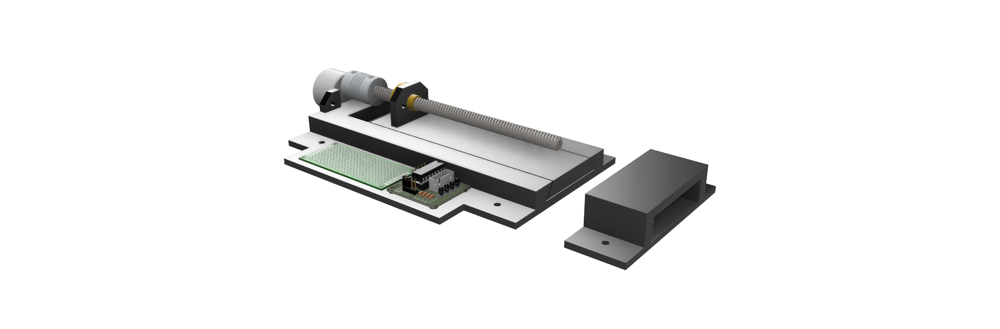

# FunLocker - Bluetooth Enabled Lock and Application

Simple demo/prototype Bluetooth ‘Smart Lock.’ Includes a combination of custom BLE enabled Arduino/ESP32 device code, small cross-platform Flutter based controller application, and 3D printable CAD design.

Built as a general learning exercise with a practical utility as well. The model could be updated with more sturdy materials if true security was required.

Project includes:

- Fusion360 model
- Arduino C++ code suitable for ESP32-C3 Devkit (should work on others as well)
- Flutter based client application code, tested on i0S/MacOS/Web but should work on other platforms

