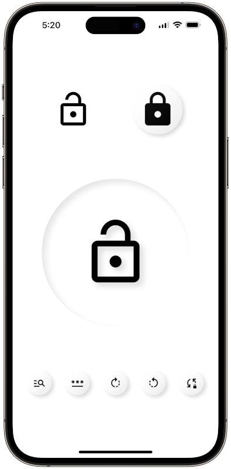
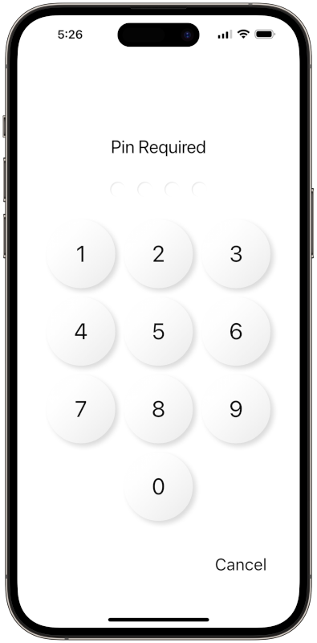

# Funlocker Client Application (Mobile/Desktop/Web)

Simple Flutter based application designed to interact with a custom *prototype* ‘smart lock’ via Bluetooth Low Energy protocol (BLE). The application was built as a learning exercise with a practical application in my household.

> ⚠️ **Warning** ⚠️  
> Please note this is not a production ready application and as such does not implement heavy error handling or any hardened security. It only interfaces with the custom Arduino/ESP32 device code provided.




## Application Details

The FunLocker's Arduino/ESP23 (device) firmware exposes two BLE Characteristics (think messaging endpoints if not familiar). A Status Characteristic to access the current state of the device and Request Characteristic for sending commands/getting acknowledgments.

The application's BLE libraries do the heaving lifting of accessing the OS's underlining BLE capabilities plus exposing both the BT adapter and device interfaces as data Streams. With that, it simply becomes a matter of managing the async nature of the communications to synchronize the UI with the device state.

Key Application -> Device **command** communications include:

``` text
Use Case       Application               Device

Request a PIN change...
PIN Change -> [OLDPIN]-NEWPIN-[NEWPIN] -> Request Characteristic
                    READY [or ERROR] <--- Request Characteristic

Initiate the unlocking of the device...
Unlock           ---->[ PIN]-UNLOCK ----> Request Characteristic
                    READY [or ERROR] <--- Request Characteristic
                            UNLOCKING <--- Status Characteristic
                             UNLOCKED <--- Status Characteristic

Initiate the locking of the device...
Lock              --------> LOCK -------> Request Characteristic
                    READY [or ERROR] <--- Request Characteristic
                              LOCKING <--- Status Characteristic
                               LOCKED <--- Status Characteristic

Make small adjustments to the locking bolt...
Adjusting         -----> [PIN]-CCW -----> Request Characteristic
Counter             READY [or ERROR] <--- Request Characteristic
Clockwise                   ADJUSTING <--- Status Characteristic

Adjusting         ------> [PIN]-CW -----> Request Characteristic
Clockwise           READY [or ERROR] <--- Request Characteristic
                            ADJUSTING <--- Status Characteristic

Flip the UNLOCK/LOCK device setting (useful during 
testing or after system/power failure)...
Flip              -----> [PIN]-FLIP ----> Request Characteristic
                    READY [or ERROR] <--- Request Characteristic
                 LOCKED [or UNLOCKED] <--- Status Characteristic

Update the Name of the device...
Name             -----> NAME-[NAME] ----> Request Characteristic
Change              READY [or ERROR] <--- Request Characteristic

Update the Rotations required to lock the device...
Rotations     ---> ROTATIONS-[NUMBER] --> Request Characteristic
Change              READY [or ERROR] <--- Request Characteristic
```

Key application Classes/Widgets:

| Class | Purpose|
|-------------------|---------------|
| ViewDevicesScreen | Initial and base app screen (scaffold). Validates BT access and presents DeviceScanner widget |
| DeviceScanner     | Widget that scans for nearby 'FunLocker' locks. Allows user to connected to a lock and presents the DeviceControl widget if successful. |
| DeviceControl     | Widget that allows a user to interact with a device (lock/unlock/etc.)|
| PasscodeScreen    | Keyboard widget to enter PIN|

## Platform/Tech Stack Specifics

The application is written in Dart with the Flutter framework. Flutter is an excellent cross platform client application development framework. To get configure your IDE or get started with Flutter, check out <https://docs.flutter.dev/get-started/install>

**Package Dependancies**  
Funlocker leverages these awesome packages.

- Flutter Blue Plus  
<https://pub.dev/packages/flutter_blue_plus>  
 Provides BLE connectivity across operating systems

- Flutter Animate  
<https://pub.dev/packages/flutter_animate>  
Provides easy to use animation effects on a Widget level

- Logger  
<https://pub.dev/packages/logger>  
The 🐐 of Dart logging packages

- Flutter Neumorphic Plus  
<https://pub.dev/packages/flutter_neumorphic_plus>  
I originally built this app fews years ago - when Neumorphic was trending up. I still like the lightweight UI look so I kept it.  The app is a Material app - but uses special Neumorphic styled widgets - can be changed without much effort.

- Passcode Screen  
The app includes a 'clone/copy' of xPutnikx's nice passcode_screen package.  
<https://pub.dev/packages/passcode_screen>  
<https://github.com/xPutnikx/passcode_screen>  
It has been modified to fit the neumorphic theme of this app. Other than UI changes and some minor Flutter version updates it is the same.

The application should support most major operating systems including:

- MacOS ✅
- iOS ✅
- Android (untested)
- Web ✅
- Windows (untested)
- Linux (untested)

Consult the Flutter documentation for supported OS versions. To add a missing environment to the solution, use the Flutter CLI within the project directory. To add/re-add 'web' for example ...

``` sh
flutter create --platforms=web .
```

> ❗ **Important** ❗  
> Some configurations are REQUIRED for specific deployment environments - mostly related to Bluetooth permissions.  Reference <https://pub.dev/packages/flutter_blue_plus> for up-to-date platform specific configuration instructions.
