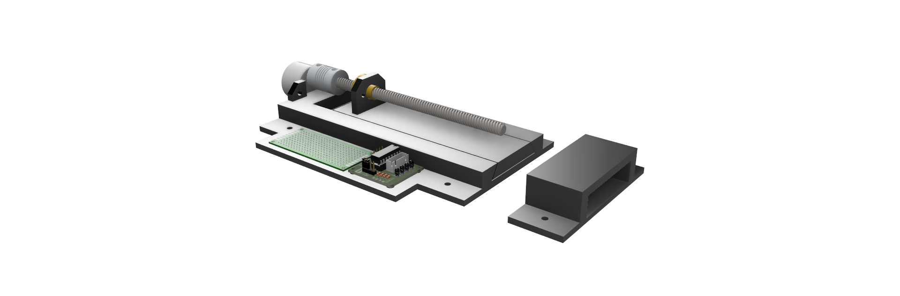

# FunLocker Prototype - CAD Design 

Simple 3D printable locking mechanism design to use a cheap 5v servo to drive/retract a slide. 
This was meant as learning/development exercise interfacing an Arduino/ESP32 with a mobile application via Bluetooth.
The device could be made much more compact if desired. The design was meant to be easily accessed via an open body - the cover was going to just be attached by hook/loop or similar but was never was finalized. I ended up installing an initial prototype and found it would well enough for my needs. Ideally the design needs a better designed cover and a more integrated PCB. 

I printed out the component parts (sans cover) using PLA which was more then adequate for my needs (basic deterrent and tamper evidence).

## Bill of Material

1 x 150mm T8 8mm Diameter Lead Screw Rod (2mm pitch - Acme)
1 x Lead Screw -  10.5mm Height; 22mm Diameter; M3 Threaded Holes;
https://www.amazon.com/dp/B07QV57SYP

1 x ULN2003 Driver Board (5v input Green Board)
1 x 5V 28BYJ-48 Stepper Motor
https://www.amazon.com/dp/B0BG4ZCFLQ

1 x Flexible Couplings 5mm to 8mm
https://www.amazon.com/gp/product/B07JL1QYLS

1 x ESP32-C3 Super Mini

1 x 30x70mm Perfboard

M3 Bolts/Nuts
